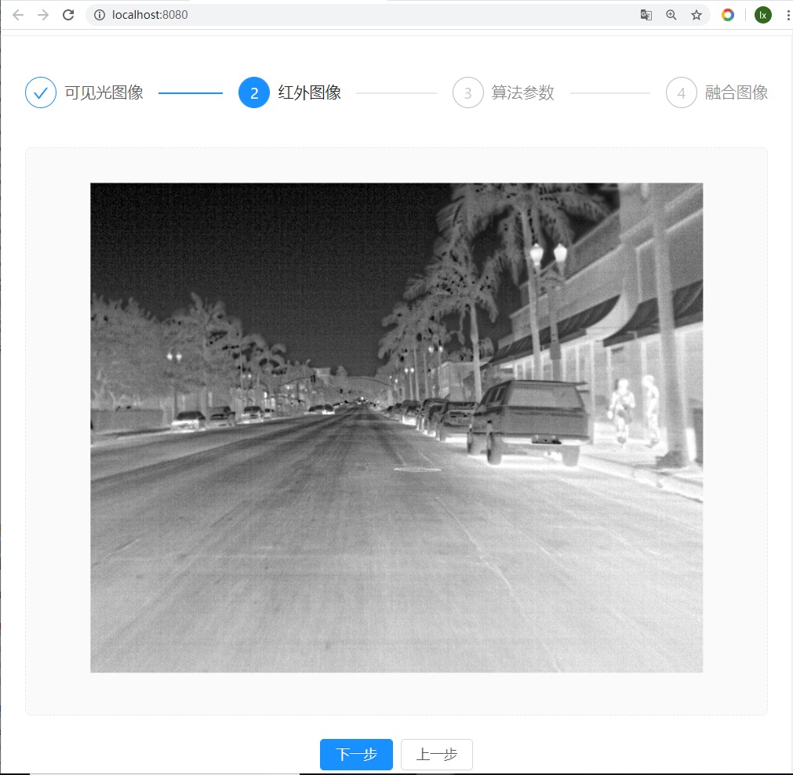
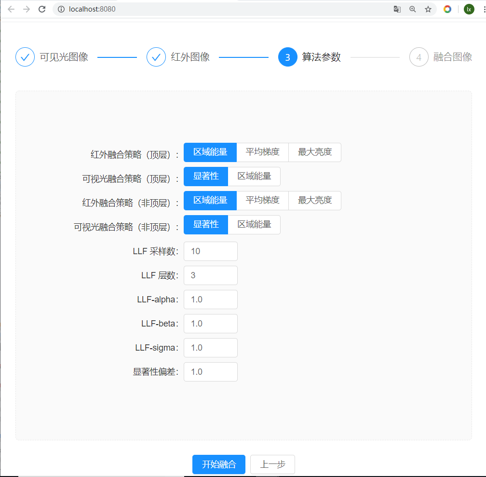

# 红外-可见光图像融合算法设计、实现及应用

### 应用效果








### 工程概览

**fusion**：windows环境下基于opencv + QT的算法实现

**fusion-refactor**：windows环境下基于opencv + QT的算法实现（重构版本，便于hls编译的过渡代码）

**fusion-vivado**：windows环境下的vivado工程

**fusion-hls**：windows环境下vivado hls工程

**fusion-hls\src_xf**：windows环境下vivado hls工程（基于xfopencv），包含项目用到的各种fpga核

**fusion-linux**：linux环境下的工程目录（包含应用的前后端工程，因为他们都要在linux环境发布）

**fusion-linux\java-fusion**：基于springboot的java服务端web项目

**fusion-linux\vue-fusion**：基于vue的前端页面

**fusion-linux\zynq-fusion**：在开发板linux系统环境运行的应用

**fusion-linux\zynq-fusion\qt-fusion**：跨平台的opencv + QT算法实现（基于zynq 7020平台），整合fpga加速

**fusion-linux\zynq-fusion\fpga-driver**：fpga驱动

### 开发环境

#### windows开发环境

**IDE**：vivado 2019.1，QT creator

**依赖库版本**：QT5，opencv 2.4.11

**工具链**：MinGW，cmake

> 使用cmake + MinGW + QT + opencv搭建开发环境。opencv源码本项目选用2.4.11，需要在windows重新编译（记得勾选with_qt选项），不妨把opencv的make install目录指定为“D:\opencv24\opencv24-qt5\”

搭建好上述环境后，即可运行调试以下工程：

- fusion
- fusion-refactor
- fusion-vivado
- fusion-hls

#### linux pc开发环境

**IDE**：QT creator

**操作系统**：我使用centos 6，ubuntu也可

**gcc版本**：5.5.0

```
centos6上原先的gcc版本较低，有些新的语法不支持，编译的时候会报错，因此需要升级。

注意：我曾经试过用6.3.0版本的gcc，但是编译opencv 2.4.11版本会报错，因此选用版本5.5.0

建议从hust华中科技大学的gnu网站上下载gcc源码，编译以及安装过程参考：

cd gcc-5.5.0
mkdir build
cd build
../configure --prefix=/usr/local/gcc --enable-languages=c,c++ --disable-multilib（安装到/usr/local/gcc，注意下）
make -j8 （开启8个线程编译，十几分钟可以编译完）

make install

以下命令是将原来的gcc备份并替换新编译的gcc

mv /usr/bin/gcc /usr/bin/gcc6.3
ln -s /usr/local/gcc/bin/gcc /usr/bin/gcc
mv /usr/bin/g++ /usr/bin/g++6.3
ln -s /usr/local/gcc/bin/g++ /usr/bin/g++
mv /usr/bin/cc /usr/bin/cc6.3
ln -s /usr/local/gcc/bin/gcc /usr/bin/cc
mv /usr/bin/c++ /usr/bin/c++6.3
ln -s /usr/local/gcc/bin/c++ /usr/bin/c++

rm -rf /usr/lib64/libstdc++.so.6（这里可以locate libstdc++.so.6看下原来的路径，都删掉）
ln -s /usr/local/gcc/lib64/libstdc++.so.6.0.21 /usr/lib64/libstdc++.so.6
g++ --version
经过上边一通操作之后就装好了
```

**opencv版本**：2.4.11

```
可以把windows环境的opencv源码直接拷贝到linux环境,重新编译即可

cd sources/

mkdir build

cd build

cmake -D CMAKE_BUILD_TYPE=RELEASE  -D CMAKE_INSTALL_PREFIX=/data1/opencv -D ENABLE_PRECOMPILED_HEADERS=OFF -D WITH_QT=ON  .. （安装到/data1/opencv，注意下）

make -j8

make install

注意：此时要配置下pkgconfig，ldconfig（具体细节我没有详细研究，但是得有），可执行下面两个命令验证下opencv的环境是不是ok了
ldconfig -v | grep opencv
pkg-config --cflags --libs opencv
```

导入**fusion-linux\zynq-fusion\qt-fusion**工程即可运行调试。

#### 开发板

略

#### 其它

**fusion-linux\java-fusion**：基于springboot的java服务端web项目。构建、发布同一般java springboot项目。

> 准备maven，java环境即可编译该工程。maven install即可构建出jar包，在安装java环境的服务器中执行nohup java -jar xx.jar 即可运行。

**fusion-linux\vue-fusion**：基于vue的前端页面。构建、发布同一般vue项目。

> yarn build即可编译出dist，将其拷贝到nginx环境即可。
